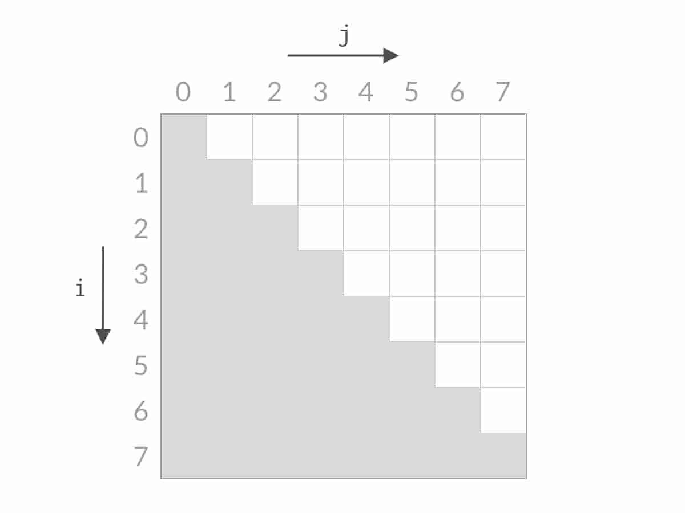
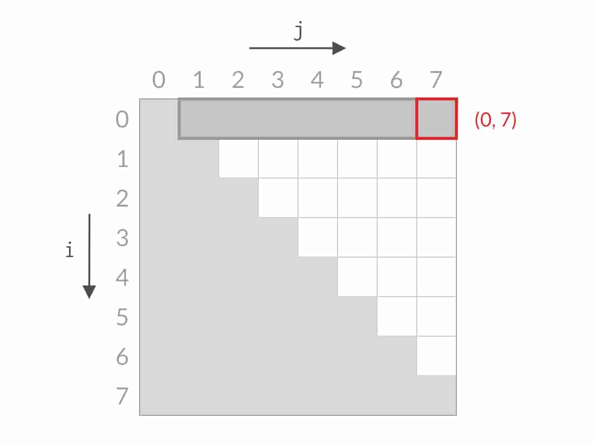
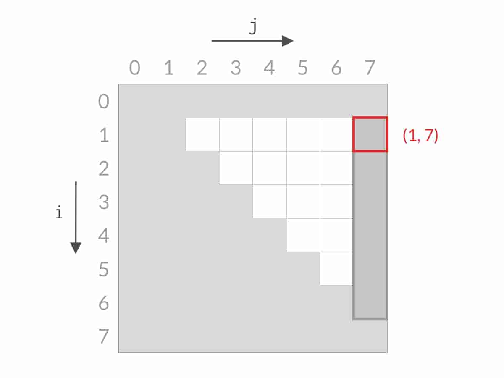
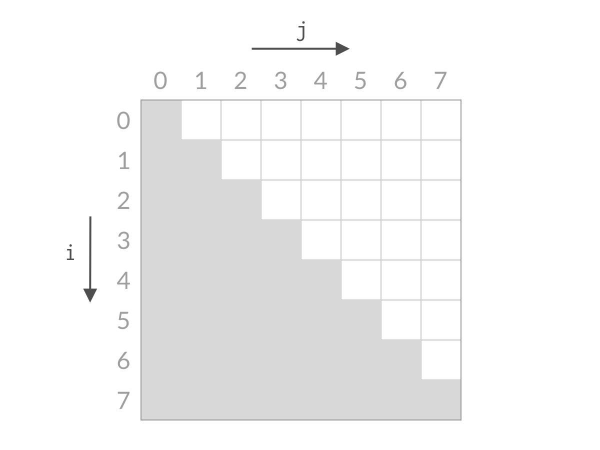

##### 题目

给一个整数数组height，height[i] 为第 $i $ 条垂线的高度，找出两个线使得它们与x轴构成的容器可以容纳最多的水，返回该最大水量；

##### 解答

1. 暴力枚举

   ~~~cpp
   int maxArea(vector<int> &height)
       {
           int maxArea = 0, n = height.size();
       
           for (int left = 0; left < n; left++)
           {
               for (int right = left + 1; right < n; right++)
               {
                   int temp = min(height[left], height[right]) * (right - left);
                   maxArea = max(maxArea, temp);
               }
           }
       
           return maxArea;
       }
   ~~~

---

2. **双指针**

- 策略：
  - 初始：左指针为索引0，右指针为索引 $n-1$ ，计算此刻水量；
  - 向内移动短边指针，水量变多则更新maxArea；

- 有效性分析：**缩减搜索空间**
  - 引理：**向内移动长边指针水量必减少** → 因为短边决定水高，而宽度减少1；

  - 假设 $n=8$ ，则暴力枚举的搜索空间为：(白色方格)

    

    可见时间复杂度为 $O(n^2)$；

  - 首先检查 $(0, 7)$，若 $j=7$ 是长边，根据引理，$i=0$ 全部被排除，搜索空间变为：

    

  - 然后检查 $(1,7)$，若$i=1$ 是长边，根据引理，$j=7$全部被排除：

    

  - 这样每次检查一对边，都会排除一行或者一列，最终必定能找到最优解：

    

    可见时间复杂度降低到了 $O(n)$；

    从这里也可见如何将时间复杂度从 $O(n^2)$  优化到 $O(n)$；

~~~cpp
int maxArea(vector<int> &height)
{
    int left = 0, right = height.size() - 1;
    int maxArea = 0;

    while (left < right)
    {
        // 如果水量变多就更新masArea
        maxArea = max(maxArea, min(height[left], height[right]) * (right - left));
        
        // 缩减搜索空间
        if (height[left] > height[right])
            right--;
        else
            left++;
    }
    return maxArea;
}
~~~

